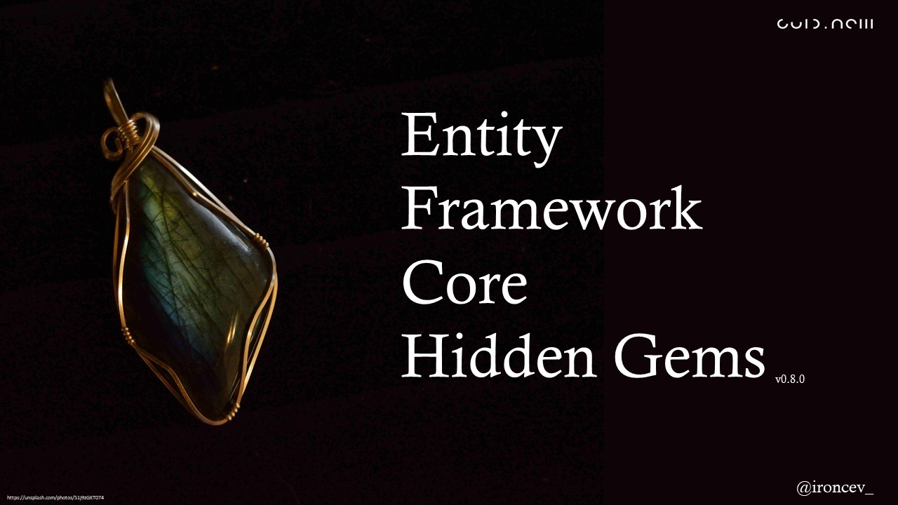

# Entity Framework Core Hidden Gems

## Talk Description

Basic Entity Framework Core features are, I guess, well-known to you. Plain mapping of objects to underlying database tables is straightforward and easy to use.

But EF Core has much more power to offer. My consultancy practice tells me that this power is often neither recognized nor know to developers.

In this talk, I share with you certain lesser-known EF Core features that I would expect to see more often in real-life code. They replace cumbersome hand-made "solutions" with robust alternatives that are easy to implement and maintain.

Through examples that depict real-life cases that I've seen, I'll demonstrate features that will help you to:
- gain more performance out of your queries.
- smoothly work with legacy databases.
- obtain readable diagnostic logs.
- fight anemic domain models.

You will leave the talk with two things under your belt - a set of powerful EF Core features and a clear understanding of how to put them into practice in your projects.

## Talk History

|                           Version                            | Date                          | Event                                                        |       City        | Country | Video |
| :----------------------------------------------------------: | ----------------------------- | ------------------------------------------------------------ | :---------------: | ------- | ----- |
| [v0.8.1](https://github.com/ironcev-talks/entity-framework-core-hidden-gems/releases/tag/2020-06-27-Online-Dot-Net-Developers-NCR-Chapter-Meetup) | June&nbsp;27th,&nbsp;2020 | [Dot Net Developers NCR Chapter [Meetup]](https://www.meetup.com/Dot-Net-Developers-NCR-Chapter/events/271305193/) | &lt;Online&gt; | -   | - |
| [v0.8.0](https://github.com/ironcev-talks/entity-framework-core-hidden-gems/releases/tag/2020-03-31-Online-Microsoft-Developer-User-Groups-Graz-and-Rijeka-Meetup) | March&nbsp;31st,&nbsp;2020 | [Microsoft Developer User Groups Graz and Rijeka [Meetup]](https://www.meetup.com/MicrosoftDeveloperGraz/events/269488523/) | &lt;Online&gt; | -   | [YouTube](https://www.youtube.com/watch?v=RuncQLzQZJI) |
| [v0.3.3](https://github.com/ironcev-talks/entity-framework-core-hidden-gems/releases/tag/2020-02-20-Palma-de-Mallorca-Spain-Netsaimada-Meetup) | February&nbsp;20th,&nbsp;2020 | [Netsaimada [Meetup]](https://www.meetup.com/Netsaimada/events/268355607/) | Palma de Mallorca | Spain   | - |
| [v0.1.0](https://github.com/ironcev-talks/entity-framework-core-hidden-gems/releases/tag/2019-12-04-Zagreb-Croatia-Advanced-Technology-Days-Conference) | December&nbsp;4th,&nbsp;2019  | [Advanced Technology Days [Conference]](https://advtechdays.com/predavanja/) |      Zagreb       | Croatia | - |

## Presentations

The latest minor version of the presentation is available for viewing and download on [SlideShare](https://www.slideshare.net/roncevi/entity-framework-core-hidden-gems-v080-231160063) and [Speaker Deck](https://speakerdeck.com/ironcev/entity-framework-core-hidden-gems). The exact presentations used in talks are available on the [release page](https://github.com/ironcev-talks/entity-framework-core-hidden-gems/releases). The presentations used in talks vary significantly from each other. Their content depends on the exact talk format, duration, and audience. The version on SlideShare and Speaker Deck contains all the slides.

## Examples

The examples are available in the [examples folder](examples). Each subfolder contains a README.md file with additional reading material.

## License

The sample source code is in the public domain. To the extent possible under law, Igor Rončević has waived all copyright and related or neighboring rights to the sample source code.

The presentations are licensed under [CC BY 4.0](https://creativecommons.org/licenses/by/4.0/).